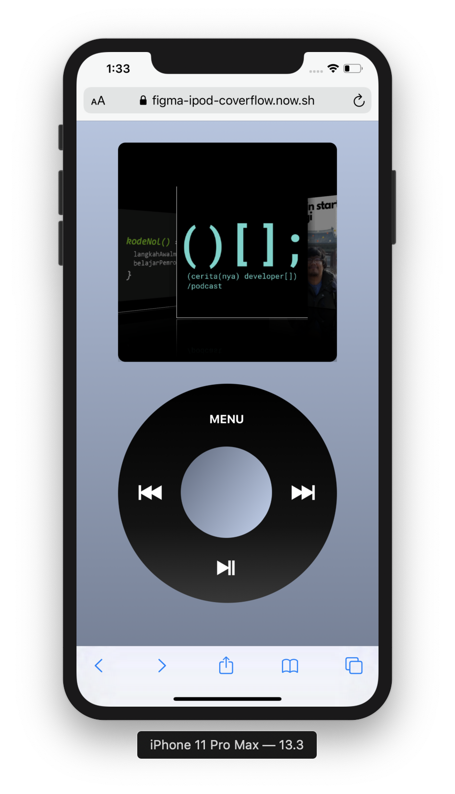

# Figma iPod CoverFlow

Inspired by these two tweets, [Figma Platformer Engine](https://twitter.com/alyssaxuu/status/1104473813201444865) and [iPod - iPhone App](https://twitter.com/elvin_not_11/status/1199717678908366854), I have an idea to make a classic playlist of my favorite podcast on spotify. So I created the list of podcast in Figma, I can arrange and edit the cover as I want.

[Live Version](https://figma-ipod-coverflow.now.sh/)

## Features

- Create your own playlist
- Share Your Playlist
- Coverflow slider animation (Classic Apple Style)
- Classic iPod scroll wheel interaction

## Deploy Your Own

Deploy your own iPod project with ZEIT Now.

_Live Example: https://create-react-app.now-examples.now.sh_
